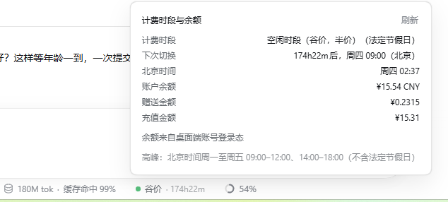

# dsh-tide-badge

DSH 输入框下方的**计费时段与余额**药丸：显示当前是**峰价**还是**谷价**、距离下次切换还有多久，点开看完整读数与账户余额。



上图：点开后的面板（计费时段 / 下次切换 / 北京时间 / 账户余额与赠送、充值明细），以及底部统计行里的药丸。

## 安装

在**插件管理器**（Add plugin）的搜索框里填 `dsh-tide-badge` 装上，或者用 CLI：

```bash
dsh plugin --profile web add dsh-tide-badge
```

已发布到 npm：[dsh-tide-badge](https://www.npmjs.com/package/dsh-tide-badge)。装好后**重启 DSH**。药丸会出现在输入框下方、原生「缓存命中」那一排的后面。

> 需要 DSH ≥ 0.1.0-rc.5 与 Node ≥ 20。

## 它做什么

- **峰价 / 谷价**（按官方规则，含中国法定节假日与周末）
- **切换倒计时**，每秒本地推进
- **账户余额**：桌面端账号登录态优先，`DEEPSEEK_API_KEY` 兜底

融合了两个插件的长处：

| 来源 | 采纳的部分 |
|---|---|
| [`dsh-billing-badge`](https://github.com/devacc8/dsh-billing-badge)（MIT） | UI 形态：挂在原生统计行（"缓存命中"那一排）的小药丸、点击展开的面板与布局、原生样式变量 |
| [`dsh-whale-widget`](https://github.com/MeteorNOX/DeepSeek-Balance-Whale-Widget)（MIT） | 余额取数（桌面端账号登录态优先、API Key 兜底）与**中国法定节假日**适配、峰谷生效分界线 |

两者的代码均为 MIT 许可，本项目在其基础上重写与合并；峰谷与节假日逻辑按官方计费规则重新实现并加了单元测试。感谢两位作者。

## 显示位置

输入框下方统计行里、紧跟原生"**缓存命中**"药丸之后的一枚小圆点药丸：

```
● ¥8.22 · 本次 ¥0.31 · 谷价 · 82h01m
  ↑账户余额   ↑本次对话花费   ↑档位  ↑距下次切换
```

- **账户余额**与**本次对话花费**都常显在药丸上，不必点开。（花费为淡色，余额为主色。）
- **峰价 · 2h13m** / **谷价 · 45m**，圆点颜色：峰价橙色、谷价绿色
- 点击展开面板：计费时段（含"法定节假日"/"周末"标记）、下次切换、北京时间、账户余额（余额/赠送/充值明细）

### 本次对话花费怎么算

用**余额差值**记账，而不是 token × 单价：

- 采样点是**每一次拿到新余额读数**：既有的"对话停止满一分钟后刷新余额"是主要来源，首次挂载与手动刷新（打开面板、点面板里的刷新）也各记一笔
- 之所以三条路径都记：只挂在自动刷新上的话，首次挂载不会播种基准，新对话的"本次"要等第一次闲满才出现（0.2.0 就是这个毛病）
- 因此它是**真实扣费**：缓存命中、思考 token、峰谷价都由账单自己体现，不需要维护价目表，也不会出现"算出 ¥0.42、实际扣 ¥0.51"的偏差
- **对话进行中**显示已结算的累计值；**一轮结束满一分钟后**该轮花费被计入
- **新对话**从 0 起算；充值（余额上升）不做负向记账，不会出现负数
- 账本按**对话 id**分开记，存在浏览器 `localStorage`（键 `dsh-tide-badge/session-cost`），刷新/重启不丢

#### 思考期间不会取余额

自动刷新每 5 秒检查一次，以下任一成立就直接跳过，**不发起取数**：

| 条件 | 含义 |
|---|---|
| 芯片未挂载 | 没地方显示，没必要请求 |
| 页面在后台 | `document.hidden` |
| 60 秒内有动静 | `[data-conversation-scroll]` 的 DOM 变动会重置计时 |
| 有会话在跑 | 会话快照的 `running` 为真 |

所以**模型思考超过一分钟时不会刷新余额**——思考中文字在流式输出、工具在刷新，对话区一直在变，倒计时永远差不满；`running` 也始终为真。只有整轮结束、真正静下来满 60 秒才取一次。

这对金额没有损失：差值法只要求"两次读数之间不漏"，思考期间产生的扣费会在下一次静闲读数里被一并计入。

两点精度边界：

- 取数用的是**非强制**刷新，会吃到宿主侧 60 秒 TTL 缓存。若上一轮与这一轮间隔很短，可能出现**几轮的扣费合并成一个差值**——金额仍准确，只是"哪一轮花的"被合并（按对话累计本就不区分轮次）。
- 实际表现：每轮结束后 **1～2 分钟内**数字更新到位。

在思考**中途**点开面板不会丢账：面板刷新是强制取数，那一刻会把此前花费先记入，并把基准推到中途；之后静闲时只计入剩余部分，两边不重不漏。

> 已知边界：余额是**账户级**读数。若同一账号在别处（手机 App、另一个 DSH）同时消耗，那部分会被算进本对话。

## 计费规则（判定依据）

官方 [模型 & 价格](https://api-docs.deepseek.com/zh-cn/quick_start/pricing) 脚注 (2)：

> 北京时间**周一至周五（不含中国法定节假日）9:00–12:00、14:00–18:00** 为高峰时段；
> 其余时段，包括**周末及中国法定节假日全天**均为空闲时段。
> 空闲时段价格为高峰时段价格的一半。

历史回放按当时规则计价，因此带生效分界线：

| 规则 | 生效时刻（北京） |
|---|---|
| 峰谷定价实施 | 2026-08-17 00:00 |
| 周末全天谷价 | 2026-08-23 00:00 |
| 法定节假日全天谷价 | 2026-09-19 00:00 |

## 余额从哪来

两条路，**账号优先**：

1. **桌面端账号登录态** —— 走 DSH 自己的 `deepseekAccount` 服务。官方 `/user/balance` 只认 `sk-` 开头的 API Key，而桌面端登录用的是 OAuth 授权，所以登录用户必须走这条路。面板底部会注明"余额来自桌面端账号登录态"。
2. **API Key** —— `DEEPSEEK_API_KEY`（DSH 凭据或环境变量）→ `GET /user/balance`。账号路不可用时才走，作为兜底。

**失败时不留白。** 两条路互不通气时，面板底部会把各自的原因分别摊开（`账号路：…；API Key 路：…`），而不是笼统一句"未配置"。账号路区分这些情况：服务不存在 / 未登录 / 平台查询失败（登录态可能过期）/ 没有余额钱包 / 钱包数据无法解析。

> 为什么账号优先：若凭据里残留一个**无效**的 API Key，密钥路的失败会掩盖本该成功的账号路（本机就踩过：一个 32 位十六进制串导致长期 401）。

API Key 不出宿主进程，浏览器只拿到余额数字。失败一律降级成面板上一行文案，不抛出。

### 为什么账号路带重试

余额查询打的是 `platform.deepseek.com`，而**推理**打的是 `api.deepseek.com` ——两个域，两条网络路径。装了会做 HTTPS 解密的杀软（如 Kaspersky）时，`platform` 域会**间歇性** TLS 失败：解密连接插入自签根证书，Node 的 undici 只认自带 CA 列表、不读 Windows 证书库，于是报 `SELF_SIGNED_CERT_IN_CHAIN`。

本机实测约 **3/8 概率失败**，且是随机的 —— 所以 `readAccountBalance` 带 3 次重试，单次失败不影响最终结果。

若要根治，可让 Node 信任杀软根证书（会信任链多一环，属常规权衡）：

```powershell
# 1) 导出根证书为 PEM，2) 指向它
[Environment]::SetEnvironmentVariable('NODE_EXTRA_CA_CERTS', '<根证书.pem 的绝对路径>', 'User')
```

设置后重启 DSH。本机实测该方案 8/8 成功。

## ⚠️ 年度维护：节假日表

`lib/holidays.mjs` 是**唯一需要每年更新**的文件。国务院办公厅通常每年 11 月发布次年安排，届时补录 `HOLIDAY_VALLEY`。

**只列放假的日期**：调休上班日全部落在周末，按"周末也是谷价"的规则本就是谷价，无需单列。

漏录不会报错，只会**静默地**把工作日假期误判成峰价（多算钱）。插件启动时会自检并在日志里提醒缺少哪一年。

当前覆盖：**2026 年**。

## 架构

```
lib/
  holidays.mjs        节假日表 + 三条生效分界线（年度维护点）
  season.mjs          峰谷判定、下一次切换、文案与颜色（两端共用）
  season.test.mjs     单元测试（29 项，覆盖窗口边界/生效线/切换点）
  index.js            宿主半边：/plugins/tide-badge/state 只读路由
  build.mjs           把 season/holidays 内联进客户端
  client.js           由 build.mjs 生成，勿手改
client.template.js    客户端模板
cordis.patch.yml      bundle 组装补丁
```

**两端同源**：浏览器半边是由宿主注入的普通脚本，其 `require` 不认识相对路径 import，所以 `build.mjs` 把 `season.mjs` 与 `holidays.mjs` 内联进 `client.js`。节假日清单也由宿主通过路由下发，前端用同一份源码复算 —— 保证两端算出的切换点完全一致。

## 开发

```bash
node lib/build.mjs          # 改完 season/holidays 后重新内联客户端
node lib/season.test.mjs    # 跑单元测试
node --check lib/client.js  # 语法校验
```

改完需**重启 DSH** 才生效（宿主半边在启动时装配）。
